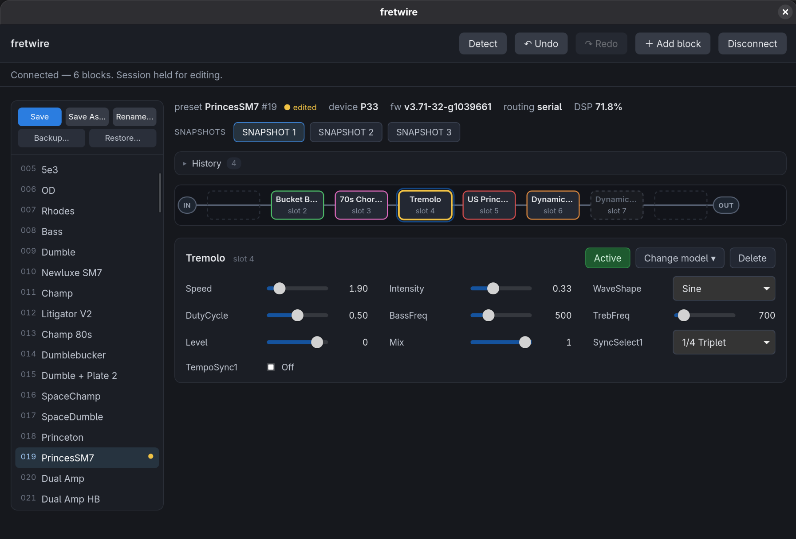
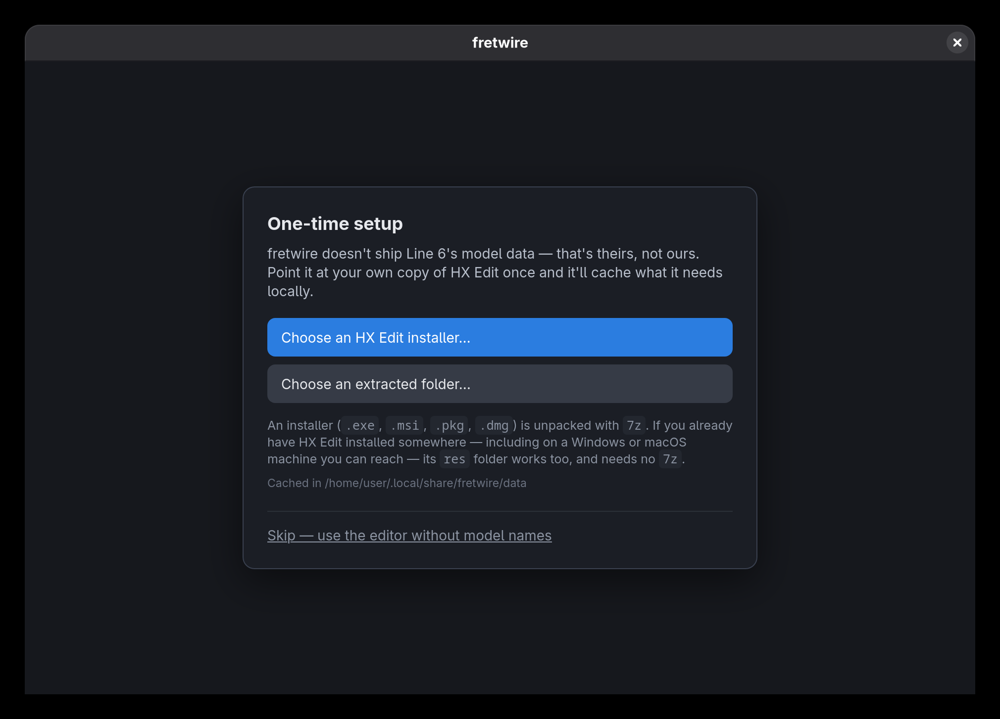

# fretwire

An independent, from-scratch **Linux editor for the Line 6 HX Stomp**, written in Rust.

fretwire talks to the pedal over its `MI_00` USB control interface (VID `0x0E41` / PID `0x4246`).
The wire protocol was recovered by **observing USB traffic to and from the device**; the model,
preset, and control **data is not included** — fretwire reads it at runtime from a copy you import
from your own HX Edit installation (see [The reference data](#the-reference-data)).



> ⚠️ **No warranty. Use at your own risk — see [Disclaimer](#disclaimer).** Firmware/flash/DFU
> operations are deliberately out of scope and never transmitted (`docs/safety.md`).

## Layout

| path | what |
|------|------|
| `crates/fretwire-data`     | parsers for the shipped JSON (`*.models`, catalog, controls, `.hlx` presets) |
| `crates/fretwire-protocol` | `MI_00` wire message types + codec |
| `crates/fretwire-usb`      | USB transport via `nusb` |
| `crates/fretwire-core`     | device session API |
| `crates/fretwire-cli`      | `fretwire` command-line driver |
| `crates/fretwire-tauri`    | the graphical editor — Tauri (WebKitGTK) + Svelte |
| `captures/`                | per-capture action notes + small preset-stream fixtures used by the tests |
| `docs/`, `ROADMAP.md`      | protocol notes, preset format, safety, and the plan |

## Install

Grab a package from [Releases](https://github.com/john-baxter-dev/fretwire/releases) — no toolchain,
no build:

| distro | file |
|--------|------|
| Debian, Ubuntu, Kubuntu, Mint | `fretwire_<version>_amd64.deb` — `sudo apt install ./fretwire_*.deb` |
| Fedora, openSUSE              | `fretwire-<version>.x86_64.rpm` — `sudo dnf install ./fretwire-*.rpm` |
| Arch, CachyOS, EndeavourOS    | the AUR package (`packaging/PKGBUILD`) |
| anything else                 | `fretwire-<version>_amd64.AppImage` — `chmod +x`, run it |

The `.deb` and `.rpm` pull in WebKitGTK themselves, install the **udev rule** for you, and ship both
the GUI (`fretwire-gui`) and the CLI (`fretwire`). **Unplug and replug the pedal after installing** —
that's when the new udev rule takes effect.

The AppImage can't install a udev rule (nothing outside the bundle can be written), so run
`fretwire install-udev`, or copy `packaging/70-hxstomp.rules` into `/etc/udev/rules.d/` by hand.

Then launch it. On first run the app asks for your HX Edit installer or `res` folder so it can
[import the model data](#the-reference-data) — that step is what turns numeric parameter indices
into real model and parameter names.



Want to see the interface before installing anything? The whole UI runs in a browser against a
[mock device](#no-hardware-no-rust) — no pedal, no Rust, no packages.

## Build from source

Needs **Rust 1.96 or newer** (`rustup update` if your distro's toolchain is older).

```
cargo build
cargo test
cargo run -p fretwire-cli -- detect                 # is an HX Stomp connected?
cargo run -p fretwire-cli -- show-preset <stream>   # decode a reassembled device preset stream
```

The CLI binary is `fretwire`. `show-preset` takes a reassembled preset MessagePack stream and prints
its blocks with resolved model ids, device param order (Mono/Stereo), and current values — offline.

`cargo build` deliberately skips the GUI, so it needs no system libraries beyond a Rust toolchain.

### The graphical editor

`fretwire-tauri` is the editor: a WebKitGTK window over a Svelte frontend, on the same
`fretwire-core` session the CLI uses. It's **not** part of `cargo build` — it needs system libraries
and a built frontend, so you opt into it.

**1. System libraries.** Only needed to *compile* the GUI — installing a package instead pulls in the
runtime libraries automatically:

```
# Debian / Ubuntu / Kubuntu
sudo apt install build-essential pkg-config libwebkit2gtk-4.1-dev
# Arch (headers ship in the main package; you may have these already)
sudo pacman -S base-devel webkit2gtk-4.1
# Fedora
sudo dnf install gcc gcc-c++ make pkgconf-pkg-config webkit2gtk4.1-devel
```

Plus **Node 20+** for the frontend build.

**2. Build the frontend.** The Rust crate embeds `crates/fretwire-tauri/dist/` at compile time, and
that directory is a build artifact — it isn't in git. Build it first, or the build stops and tells
you to:

```
cd crates/fretwire-tauri/ui
npm install
npm run build          # → ../dist
```

Re-run `npm run build` after any frontend change; the Rust side won't pick it up otherwise.

**3. Run it.**

```
cargo run -p fretwire-tauri --features custom-protocol
```

The `custom-protocol` feature is what tells Tauri to serve the `dist/` you just built instead of a
dev server; without it the window opens on *"Could not connect to localhost: Connection refused"*.
(`--release` makes no difference to this — only the feature does.) To work on the UI with hot
reload instead, use `cd crates/fretwire-tauri && npm exec --prefix ui tauri dev`, which starts both
the dev server and the app.

Connect, browse presets, edit blocks and parameters, drag blocks around the routing grid, manage
snapshots, save, back up and restore. It live-follows the hardware, so footswitch and panel changes
show up in the window. (The app forces WebKitGTK's non-dmabuf compositing path on Linux by default —
some GPU/compositor combinations hit a fatal Wayland protocol error otherwise. Set
`WEBKIT_DISABLE_DMABUF_RENDERER` yourself to override.)

**Packaging it.** `crates/fretwire-tauri && cargo build --release -p fretwire-cli && tauri build`
produces the `.deb`/`.rpm`/AppImage (the CLI build comes first because the packages bundle it). CI
does exactly this on a tag — see `.github/workflows/release.yml`.

### No hardware, no Rust

The frontend runs standalone in a browser against an in-memory **mock device** — no pedal, no Rust
toolchain, no Tauri, no system libraries:

```
cd crates/fretwire-tauri/ui
npm install
npm run dev            # → http://localhost:5173
```

When it can't find a Tauri runtime it routes every backend call to the mock, which implements the
full command surface: a setlist, the model catalog, split routing, and simulated live pushes from
the hardware. `fretwireMock.needsData()` then reload shows the first-run import screen.
See `crates/fretwire-tauri/ui/README.md`.

## Talking to a real device

Linux's default `uaccess` tags only `/dev/snd/*`, not the HX Stomp's raw vendor USB node, so without
a udev rule every live command needs root. **The `.deb` and `.rpm` install the rule for you** — for
an AppImage or a source build, do it once:

```
cargo run -p fretwire-cli -- install-udev   # writes /etc/udev/rules.d/70-hxstomp.rules, reloads udev
```

It writes directly when run as root, otherwise re-runs the privileged steps through `sudo`
(`install-udev --print` just emits the rule if you'd rather install it by hand; the canonical copy
lives in `packaging/70-hxstomp.rules`). **Unplug and replug the device** afterward. Then:

```
cargo run -p fretwire-cli -- detect       # HX Stomp: present
cargo run -p fretwire-cli -- pull         # read the loaded preset (non-destructive)
```

The rule covers both the HX Stomp (`0x4246`) and HX Stomp XL (`0x4253`).

## The reference data

The wire protocol edits by raw parameter index, so the tool works with **no** Line 6 data at all —
you just get numeric indices instead of names. To get model/param names, the DSP meter, and control
ranges, import the reference data from **your own** HX Edit installation. Nothing is redistributed:
the data goes Line 6 → you → the tool, and never through us.

The GUI asks for it on first run. From the CLI:

```
fretwire import-data <path-to-HX-Edit-installer>   # .exe/.msi/.pkg/.dmg (unpacked with 7z)
fretwire import-data /path/to/res                  # a directory: no 7z required
```

A directory source is an HX Edit install's `res/` folder, or an installer you unpacked by any means
— including one copied off a Windows or macOS machine. It caches the files under
`~/.local/share/fretwire/data` (`$FRETWIRE_DATA_DIR` overrides), and both front ends load them from
there at runtime. Builds ship **no** Line 6 data.

## License

Dual-licensed under either of

- Apache License, Version 2.0 ([LICENSE-APACHE](LICENSE-APACHE))
- MIT license ([LICENSE-MIT](LICENSE-MIT))

at your option.

## Disclaimer

fretwire is an **independent interoperability project** and is **not affiliated with, authorized,
endorsed, or sponsored by Line 6 or Yamaha Guitar Group**. "Line 6", "HX", "HX Stomp", and "HX Edit"
are trademarks of their respective owners and are used here only nominatively, to identify the
hardware fretwire interoperates with. No Line 6 software or data is included or distributed.

**THE SOFTWARE IS PROVIDED "AS IS", WITHOUT WARRANTY OF ANY KIND, EXPRESS OR IMPLIED.** To the
maximum extent permitted by law, the authors and contributors accept **no liability** for any
damage, malfunction, data loss, or other harm to your device, your presets, or anything else
arising from the use of this software. **You assume all risk.** fretwire sends control-plane
messages of the same class the official editor uses and never transmits firmware/flash/DFU traffic
(`docs/safety.md`), but hardware interoperability recovered from observation is inherently uncertain
— **back up your device before writing to it, and understand the recovery path first.**
